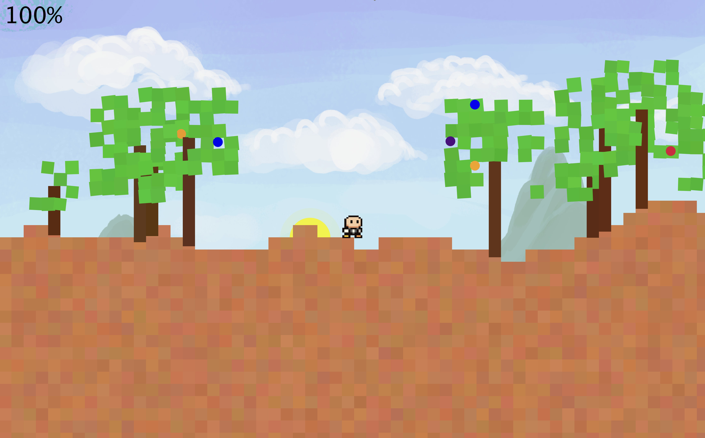
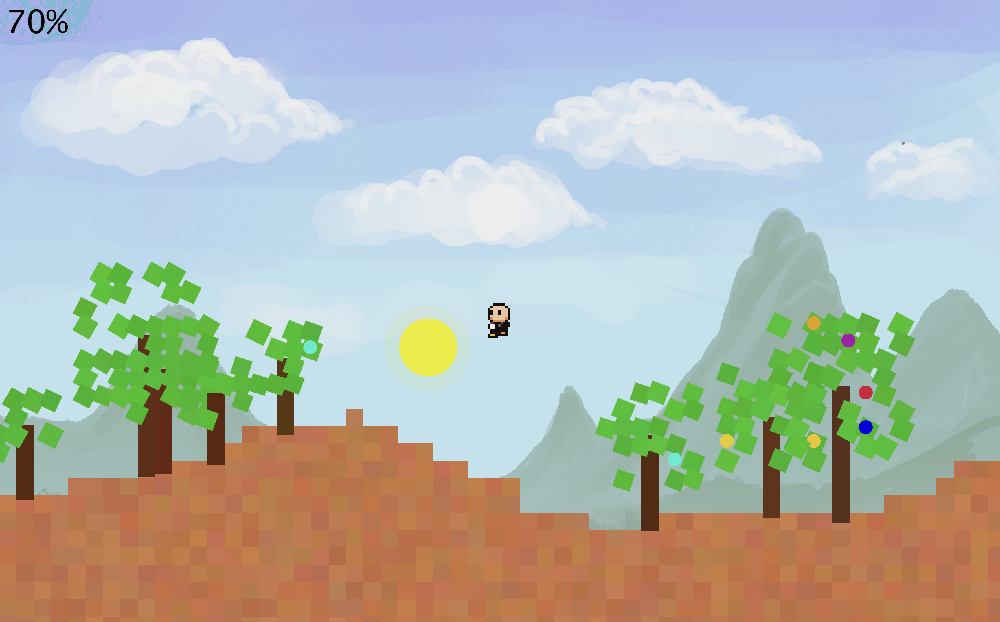

# Pepse Game

An interactive game featuring a character exploring an environmental area.  

<p float="left">
  
  
</p>

## 🎮 How to Play

Before running the game, you need to add the **DanoGameLab** dependency:  
**File → Project Structure → Modules → Dependencies → DanoGameLab.jar**

Once added, run the main class to start the game.  
Use the avatar to explore, jump, and interact with the environment.

---

## 🌳 Game Components

### Flora
- **Description:**  
  Manages the generation, addition, and removal of trees within a specified range on the game map.  
- **Relationships:**  
  - Maintains a collection (`mappedTrees`) of `Tree` objects stored by their x-coordinate in a `TreeMap`.  
- **Design Patterns:**  
  - **Strategy Pattern:** Uses `BiConsumer<GameObject, Integer>` to pass strategies for adding/removing objects in the environment.  
    This keeps the logic flexible and encapsulated.

### Tree
- **Description:**  
  Represents a full tree with trunk, leaves, and fruits. Manages creation, addition, and removal of its parts.  
  Implements the `AvatarListener` interface to respond to avatar actions (e.g., jumping).  
- **Relationships:**  
  - Composite object containing `Trunk`, `Leaf`, and `Fruit`.  
  - Listens to avatar events via `AvatarListener`.  
- **Design Patterns:**  
  - **Observer Pattern:** Reacts to avatar jump events.  
  - **Composite Pattern:** A tree is composed of multiple parts (trunk, leaves, fruits), all managed uniformly.  
    > Reference: [Composite Pattern - GeeksforGeeks](https://www.geeksforgeeks.org/composite-design-pattern-in-java)

### Trunk
- **Description:**  
  Represents the static, immovable trunk of a tree.  
- **Relationships:**  
  - Managed by the `Tree` class as part of the composite structure.

### Leaf
- **Description:**  
  Represents a tree leaf.  
  Each leaf has an independent scheduled task for animation, enabling natural swaying effects.  
- **Relationships:**  
  - Managed by the `Tree` class.  

### Fruit
- **Description:**  
  Represents fruit that grants energy to the avatar upon collision.  
  After being collected, it respawns after a delay, keeping interactions dynamic.  
- **Relationships:**  
  - Managed by the `Tree` class.  
  - Uses the **Avatar** tag to detect collisions.  

---

## 🧩 Design Patterns Summary

- **Strategy Pattern:** Flexible strategies for object management in `Flora`.  
- **Observer Pattern:** Trees listen to avatar events.  
- **Composite Pattern:** Trees are composed of multiple interchangeable parts (`Trunk`, `Leaf`, `Fruit`).  

---

## 📂 Suggested Project Layout

```
Pepse/
  src/
    Flora.java
    Tree.java
    Trunk.java
    Leaf.java
    Fruit.java
  lib/
    DanoGameLab.jar
  README.md
```

---
